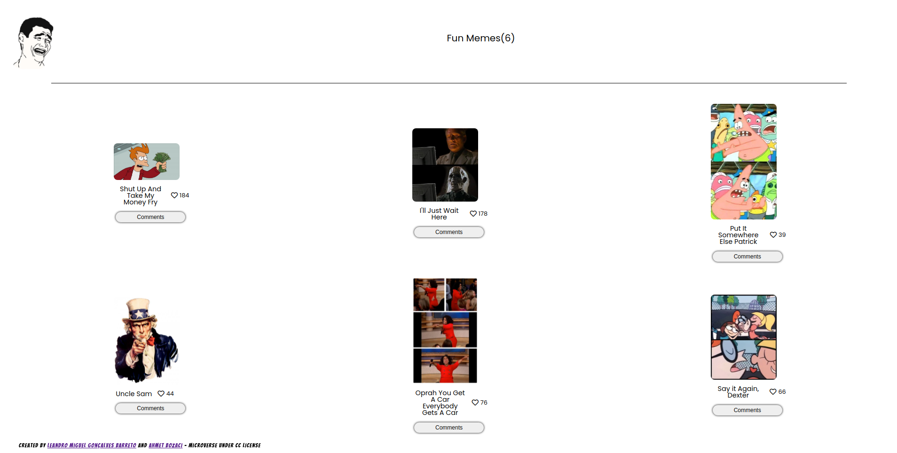

# JavaScript Capstone

This project is about  building our own web application based on an external API.

The API provides data about a topic where you can like and leave a comment.

## Presentation Video
[Video](https://drive.google.com/file/d/1TLh-8PgSv4oJwsoLeGK0XeTl5YDjLePq/view?usp=sharing)
## Built With

- HTML
- CSS
- SCSS
- Javacript
- Webpack

## Getting Started

To get a local copy up and running follow these simple example steps.

### Setup

- Clone the repo `git clone git@github.com:Leandro-Barretoo/javascript_app_capstone.git`
- `cd` into the directory
- run `npm i` or `npm install` to download required node_modules  
- open in your desired code editor
- run `npm start` to start live server

## Authors

👤 **Leandro Barreto**

- GitHub: [@Leandro-Barretoo](https://github.com/Leandro-Barretoo)
- LinkedIn: [Leandro Barreto](https://www.linkedin.com/in/leandroobarreto/)

👤 **Ahmet Bozacı**
- Github:[ ahmtbozaci](https://github.com/ahmetbozaci)
- Twitter:[ ahmtbozaci](https://twitter.com/ahmtbozaci)
- LinkedIn:[ Ahmet Bozaci](https://www.linkedin.com/in/ahmetbozaci/)

## 🤝 Contributing

Contributions, issues, and feature requests are welcome!

Feel free to check the [issues page](../../issues/).

## Show your support

Give a ⭐️ if you like this project!

## 📝 License

This project is [MIT](./LICENCE) licensed.
